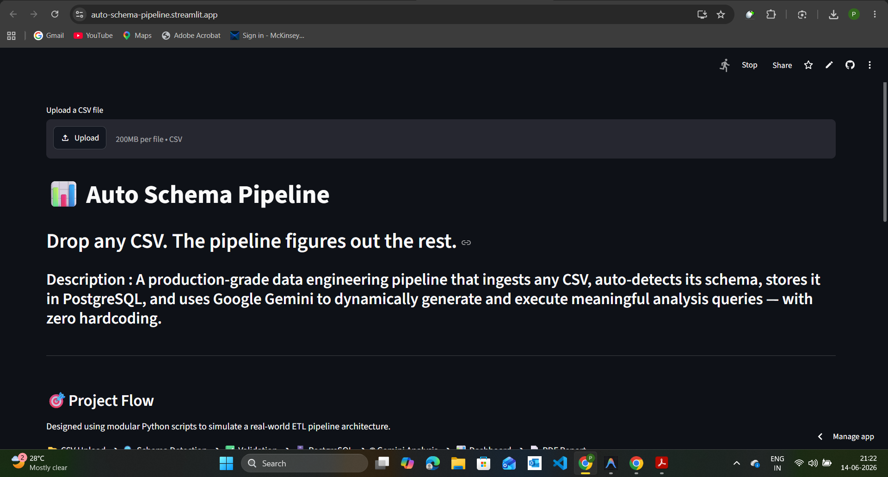
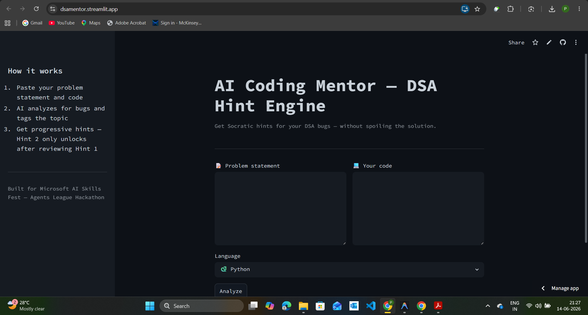
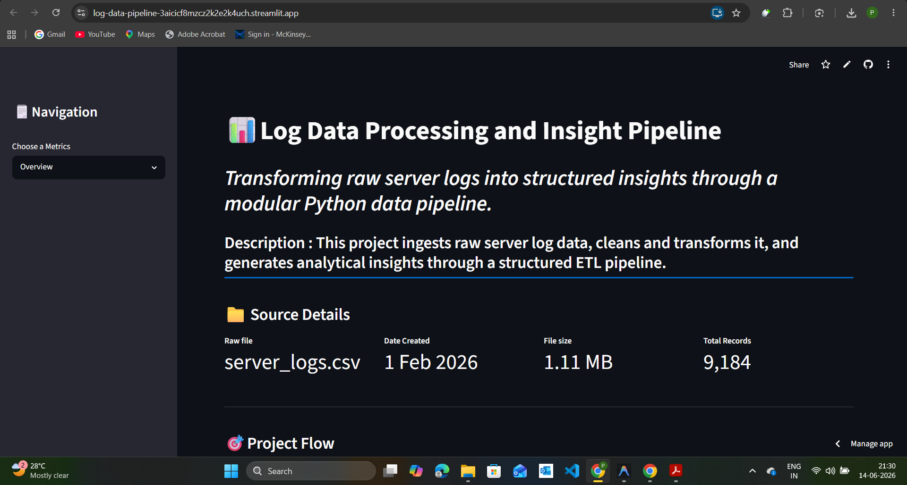

# Parth Shah

### AI Engineer & Data Systems Builder

Computer Engineering @ PICT, Pune · Building pipelines that turn raw data into real decisions

---

### About

I build at the intersection of AI, data engineering, and backend systems — not just to pass assignments, but to solve real problems. My work spans end-to-end data pipelines, LLM-backed applications, and algorithmic problem-solving, with a bias toward production-quality thinking over prototype-level code.

Currently deepening my research on LLM calibration for Indic languages, and building **FinFlow** — a pipeline that semantically maps inconsistent bank statement schemas using sentence-transformer embeddings.

- 🎓 B.Tech Computer Engineering, PICT Pune (2025–2029) — 9.85 CGPA
- 🔬 Undergrad research on LLM calibration (IndicQA, Expected Calibration Error)
- 📍 Open to AI Engineering / Data Engineering internships

---

### Tech Stack

**Languages**

**AI / ML**

**Backend & Data Engineering**

**Tools**

---

### Projects

#### [Auto Schema Pipeline](https://github.com/parthrshah202-hash/auto-schema-pipeline) · Live

CSV upload → auto schema inference → Gemini-generated SQL queries → live dashboard with exportable PDF reports. Zero manual configuration.

`Python` `FastAPI` `PostgreSQL` `Docker` `Gemini API`

[Demo](https://auto-schema-pipeline.streamlit.app/) · [Code](https://github.com/parthrshah202-hash/auto-schema-pipeline)

 

#### [AI Coding Mentor](https://github.com/parthrshah202-hash/DSA_MENTOR) · Live

A DSA hint engine that refuses to give direct answers — delivers layered, Socratic hints instead, so learners build real problem-solving ability rather than copy-pasting solutions.

`Python` `Streamlit` `Gemini API`

[Demo](https://dsamentor.streamlit.app/) · [Code](https://github.com/parthrshah202-hash/DSA_MENTOR)

 

#### [Log Data Pipeline](https://github.com/parthrshah202-hash/log-data-pipeline) · Live

Four-stage pipeline — ingestion → transformation → analysis → visualization — turning raw server logs into a nine-chart interactive dashboard with automated insight reports. Built freshman year to understand production data systems from the ground up.

`Python` `Streamlit`

[Demo](https://log-data-pipeline-3aicicf8mzcz2k2e2k4uch.streamlit.app/) · [Code](https://github.com/parthrshah202-hash/log-data-pipeline)

 

#### More

| Project | Status | Stack | Links |
|---|---|---|---|
| **FinFlow** — semantic column mapping across bank/UPI/broker statement formats using sentence-transformer embeddings + pgvector | In Progress | `Python` `pgvector` `Sentence Transformers` `Streamlit` | — |
| **Confidence Detection for LLMs** — estimating response confidence to flag uncertain/likely-incorrect LLM outputs before they reach the user | Research | `Python` `Machine Learning` `NLP` `LLM Evaluation` | — |

---

### GitHub Stats

---

### Achievements

- 200+ LeetCode problems solved · 1426 contest rating
- 5-star rating in C++ and Problem Solving on HackerRank
- Completed Microsoft AI Skills Fest — Azure AI foundations, cognitive APIs, model fine-tuning
- Completed McKinsey Forward Program

---

**Open to internships, research collaborations, and open-source contributions.**

